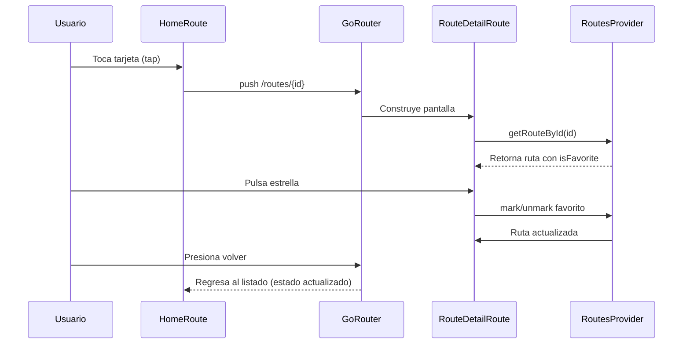

# CityBus Lite

CityBus Lite es una mini app desarrollada en Flutter que permite explorar rutas de bus,
buscar por código o nombre, revisar el detalle completo de cada ruta y marcar favoritos
persistentes utilizando almacenamiento local (`SharedPreferences`).

## Contenido

- [Características principales](#características-principales)
- [Arquitectura y módulos](#arquitectura-y-módulos)
- [Requisitos previos](#requisitos-previos)
- [Configuración del entorno](#configuración-del-entorno)
- [Ejecución de la aplicación](#ejecución-de-la-aplicación)
- [Estructura de archivos clave](#estructura-de-archivos-clave)
- [Diagramas de flujo](#diagramas-de-flujo)
- [Distribución y entrega](#distribución-y-entrega)
- [Próximos pasos sugeridos](#próximos-pasos-sugeridos)

## Características principales

- **Listado de rutas** con código, nombre y origen/destino cargados desde `assets/routes.json`.
- **Buscador en vivo** que filtra por código o nombre utilizando el provider `RoutesProvider`.
- **Detalle de ruta** con descripción completa y lista de paradas.
- **Favoritos persistentes** en `SharedPreferences`, con soporte para marcar/desmarcar desde lista y detalle.
- **Skeletons Shimmer** personalizados para estados de carga en lista y detalle.
- **Enrutamiento con GoRouter** y control de AppBar a través de `RouterAwareLayout`.

## Arquitectura y módulos

El proyecto sigue una arquitectura por feature:

- `domain/`: entidades y contratos (`BusRouteEntity`, `RoutesRepository`, `RoutesDataSource`).
- `infrastructure/`: implementaciones (`RoutesDatasourceImpl`, `RoutesRepositoryImpl`).
- `presentation/`: providers y screens (`HomeRoute`, `RouteDetailRoute`).

La capa de infraestructura carga el JSON local con `RoutesAssetService` y gestiona la
persistencia de favoritos con `FavoriteRoutesLocalService` (`SharedPreferences`).

El provider `RoutesProvider` centraliza:

1. Carga y cache de rutas (`resetData`).
2. Búsqueda (`searchRoutes`).
3. Obtención puntual (`getRouteById`).
4. Marcado/desmarcado de favoritos (`markAsFavorite`, `unmarkAsFavorite`).

## Requisitos previos

| Componente              | Versión recomendada | Notas                                                                          |
|-------------------------|---------------------|---------------------------------------------------------------------------------|
| Flutter                 | `3.24.x` o `3.32.x` | El proyecto utiliza FVM (ver `fvm_config.json`).                                |
| Dart                    | `>=3.8.1`           | Declarado en `pubspec.yaml`.                                                    |
| FVM (opcional)          | `^3.0`              | Facilita usar la misma versión de Flutter.                                     |
| Java                    | `>=17`              | Necesario para compilar Android (usar Temurin/Oracle JDK 17).                  |
| Xcode                   | `>=15`              | Para ejecutar en iOS/macOS.                                                     |
| Android Studio / SDK    | API 34              | Configurar `ANDROID_HOME` si se compila para Android.                           |
| Node.js                 | _No requerido_      | No se utilizan herramientas Node en este proyecto.                             |
| Base de datos           | _No aplica_         | La data proviene de `assets/routes.json`.                                      |

## Configuración del entorno

1. **Clonar el repositorio**
   ```bash
   git clone <repo-url>
   cd citybus_lite
   ```

2. **Instalar versión de Flutter (opcional con FVM)**
   ```bash
   fvm install 3.32.2
   fvm use 3.32.2
   ```

3. **Instalar dependencias**
   ```bash
   flutter pub get
   ```
   > Si usas FVM, reemplaza `flutter` por `fvm flutter`.

4. **Configurar assets**
   - El archivo `assets/routes.json` ya está referenciado en `pubspec.yaml`.
   - No se requiere configuración extra de API.

## Ejecución de la aplicación

```bash
flutter run
```

- Selecciona un dispositivo físico o emulador disponible.
- **No ejecutar hot reload automáticamente**; sigue el flujo manual (puedes presionar `r`
  en la terminal donde corre `flutter run`).
- Para iOS: asegurarse de tener certificados válidos y ejecutar `open ios/Runner.xcworkspace`
  si necesitas ajustes adicionales.

## Estructura de archivos clave

```
lib/
 ├─ config/router/
 │   ├─ app_router.dart              # Configuración de rutas con GoRouter
 │   ├─ router_aware_layout.dart     # Scaffold con AppBar dinámico
 │   └─ router_notifier.dart         # Estado del enrutador
 ├─ features/home/
 │   ├─ domain/
 │   │   ├─ datasources/routes_datasource.dart
 │   │   ├─ entities/bus_route_entity.dart
 │   │   └─ repositories/routes_datasource.dart
 │   ├─ infrastructure/
 │   │   ├─ datasources/routes_datasource_impl.dart
 │   │   └─ repositories/routes_datasource_impl.dart
 │   └─ presentation/
 │       ├─ providers/home_provider.dart
 │       └─ screens/
 │           ├─ home_screen.dart
 │           └─ route_detail_screen.dart
 └─ features/settings/
     └─ presentation/screens/settings_screen.dart
```

## Diagramas de flujo

### Flujo de carga y favoritos en Home

```mermaid
flowchart TD
  A[HomeRoute initState] --> B[RoutesProvider.resetData]
  B --> C{SharedPreferences contiene favoritos?}
  C -- Sí --> D[Marcar rutas con isFavorite=true]
  C -- No --> E[Retornar rutas solo desde JSON]
  D --> F[ListView con tarjetas]
  E --> F
  F --> G[Usuario pulsa estrella]
  G --> H{isFavorite?}
  H -- Sí --> I[unmarkAsFavorite(routeId)]
  H -- No --> J[markAsFavorite(routeId)]
  I --> K[SharedPreferences elimina ID]
  J --> L[SharedPreferences guarda ID]
  K --> M[RoutesProvider._refreshRoute(routeId)]
  L --> M
  M --> F
```

### Flujo de navegación y detalle



## Distribución y entrega

- Genera la APK con:
  ```bash
  flutter build apk --release
  ```
  El archivo se ubicará en `build/app/outputs/flutter-apk/app-release.apk`.
- **Adjuntar la APK en el correo** para compartir la versión completa de la app.
- (Opcional) Para iOS, ejecutar `flutter build ipa` y firmar según la cuenta de desarrollador.

## Próximos pasos sugeridos

- Agregar pruebas unitarias/widget para `RoutesProvider` y widgets de lista/detalle.
- Incluir estados vacíos adicionales (p. ej., favoritos vacíos, sin conexión).
- Extender la configuración a múltiples entornos (dev/prod) con `flutter_dotenv`.

¡Listo! Con estos pasos puedes instalar, ejecutar y distribuir CityBus Lite manteniendo
documentado el flujo completo y la lógica de favoritos persistentes.
